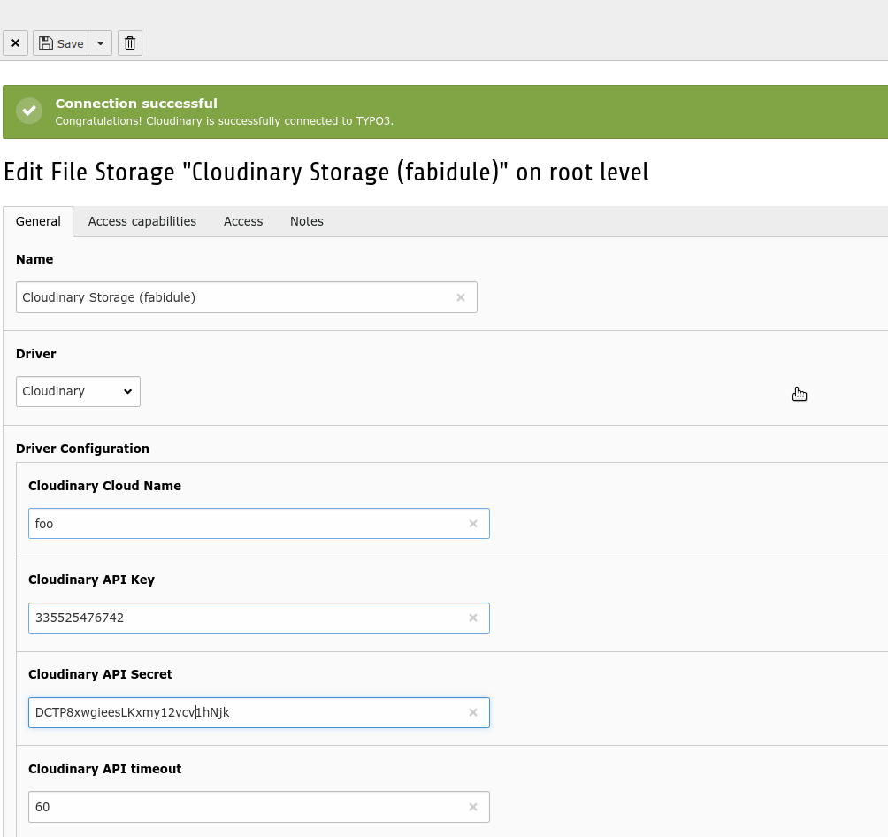

# Cloudinary Integration - FAL Driver

A TYPO3 extension that connect TYPO3 with [Cloudinary](cloudinary.com) services
by the means of a **Cloudinary Driver for FAL**.
The extension also provides various View Helpers to render images on the Frontend.
Cloudinary is a service provider dealing with images and videos. 
It offers various services among other:

* CDN for fast images and videos delivering
* Manipulation of images and videos such as cropping, resizing and much more...
* DAM functionalities where images can be tagged and metadata edited

Installation
============

The extension should be done by Composer

```
composer require visol/cloudinary
```

Note that the extension will require the library `cloudinary/cloudinary_php` and 
be automatically downloaded into `vendor`.

Configuration
=============

If it is not already the case, create an account on [Cloudinary](https://cloudinary.com/users/register/free) at first.
Once the extension is installed, we should create a [file storage](https://docs.typo3.org/m/typo3/reference-coreapi/master/en-us/ApiOverview/Fal/Administration/Storages.html). 

For a new "file storage" record, then:

* Pick the **Cloudinary** driver in the driver dropdown menu.
* Fill in the requested fields. Password and secrets can be found from the [Cloudinary Console](https://cloudinary.com/console).

Once the record is saved, you should see a message telling the connection could be successfully established. 
Then we must execute this command to index the storage.

```bash
# Where [0-9] is file storage uid
./vendor/bin/typo3 cloudinary:scan [0-9]
```



Logging
-------

For the debug purposes Cloudinary API calls are logged to better track and understand how and when the API is called.
It might be useful to check the log file in case of a low response time in the BE.

```
tail -f public/typo3temp/var/logs/cloudinary.log
```

To decide: we now have log level INFO. We might consider "increasing" the level to "DEBUG".

Caveats and trouble shooting
----------------------------

* **Free** Cloudinary account allows 500 API request per day 
* This cloudinary FAL driver is currently **limited to images**.

ViewHelpers
-----------

The extension provides ViewHelpers that can be used like that:

1. Output an images and its source-set.

```
<html xmlns:c="http://typo3.org/ns/Visol/Cloudinary/ViewHelpers">
    <c:cloudinaryImage image="{file}"/>
</html>
```

This will produces the following output:

```

```

2. Generate an array of variants that can be iterated.

```
<html xmlns:c="http://typo3.org/ns/Visol/Cloudinary/ViewHelpers">
    <c:cloudinaryImageData image="{file}">
        <f:debug>{responsiveImageData}</f:debug>
    </c:cloudinaryImageData>
</html>
```

CLI Command
-----------

Summary of the `cloudinary` commands

```bash
# Scan and warm up a cloudinary storage.
cloudinary:scan

# Query a given storage such a list, count files or folders
cloudinary:query

# Move a bunch of images to a cloudinary storage. Consult the README.md for more info.
cloudinary:move

# After "moving" files you should fix the jpeg extension. See below
cloudinary:fix

# Copy a bunch of images from a local storage to a cloudinary storage
cloudinary:copy

# Run a suite of Acceptance Tests
cloudinary:tests
```

### cloudinary:scan

**Important!**
Scan a remote cloudinary bucket and index the data in TYPO3 
We use table `tx_cloudinary_resource` and `tx_cloudinary_folder` to mirror the resources and folders of Cloudinary.

The data from these tables is kept in sync whenever a file is changed in TYPO3 (upload, rename, move, etc...). It is however a good idea
to setup a daily scheduler to scan the data so that we can detect if anything has changed on the cloudinary bucket (add or remove resources).

```
./vendor/bin/typo3 cloudinary:scan [0-9]
```

### cloudinary:query


```bash
./vendor/bin/typo3 cloudinary:query 2 --recursive --filter="---[0-9,a-z]*\\." --delete
```

### cloudinary:move and cloudinary:fix

Move bunch of images from a local storage to a cloudinary storage.

Tip: The copy / move process can be slow. To sync / upload a bunch of files beforehand, you can use the Cloudinary CLI which is convenient to upload
many resources at once. This will speed up the process.

```bash
cld sync --push localFolder remoteFolder
```

**CAUTIOUS!**
1. We are "directly" uploading a file with the Cloudinary API (skipping FAL API)
to the Cloudinary storage and deleting the one from the local storage (rm -f FILE) 
Finally we are changing the `sys_file.storage value` to the cloudinary storage.
The file uid will be kept!
  
```shell script
./vendor/bin/typo3 cloudinary:move 1 2
# param 1: the source storage uid (local)
# param 2: the target storage uid (cloudinary)

# Will all parameters
./vendor/bin/typo3 cloudinary:move 1 2 --base-url=https://domain.tld/fileadmin --folder-filter=folderFilter

# --base-url: the base URL where to download files (the file will be downloaded directly from the remote)
# --filter: a possible filter, ex. %.youtube, /foo/bar/%
# --filter-file-type: add a possible filter for file type as defined by FAL (e.g 1,2,3,4,5)
# --limit: add a possible offset, limit to restrain the number of files. (eg. 0,100)
# --yes: do not ask question. Just do it!
# --silent: be quiet!
```

After "moving" files you should fix the jpeg extension for the Cloudinary storage by running
the command below. It is worth mentioning that Cloudinary stripped the file extension for images. For instance
a file `image.jpg` or `image.jpeg` uploaded on Cloudinary will be stored as `image`
without the file extension. By inspecting the file, we will see that Cloudinary only consider 
the "jpg" extension. Consequently `image.jpeg` will be served as `image.jpg`. 
This has an implication for us. Record from table `sys_file` must be adjusted and occurrences
`jpeg` in file identifier or file name must be changed to `jpg` for consistency.

```shell script
./vendor/bin/typo3 cloudinary:fix 2
# where "2" is the target storage uid (cloudinary)
```

### cloudinary:copy

We can copy a bunch of files from one storage to another. 
This can be achieved with this command:

```shell script
./vendor/bin/typo3 cloudinary:copy 1 2         
# where 1 is the source storage (local)
# and 2 is the target storage (cloudinary)
 
# Ouptut:
Copying 64 files from storage "fileadmin/ (auto-created)" (1) to "Cloudinary Storage (fabidule)" (2)
Copying /introduction/images/typo3-book-backend-login.png
Copying /introduction/images/content/content-quote.png
...
Number of file copied: 64
``` 

### cloudinary:tests

A set of acceptance tests has been implemented to validate the functionnalities
of the driver.

```bash
./vendor/bin/typo3 cloudinary:tests fabidule:1234:ABCD 
```
Web Hook
--------

Whenever uploading or editing a file through the Cloudinary Manager you can configure an URL
as a web hook to be called to invalidate the cache in TYPO3. 
This is highly recommended to keep the data consistent between Cloudinary and TYPO3. 

```shell script
https://domain.tld/?type=1573555440
```

**Beware**: Do not rename or move files in the Cloudinary Media Library. TYPO3 will not know about the change. 

Development tools
-----------------

Type command `make` at the source of the extension to display utility commands related to code formatting. 

```
Usage:
 make [target]

Available targets:
 help:            Help
 lint:            Display formatting issues
 lint-summary:    Display a summary of formatting issues
 lint-fix:        Automatically fix code formatting issues
 tests:           Run unit tests
 tests-coverage:  Run unit tests with code coverage
 tests-watch:     Watch unit tests and run tests upon changes
```
